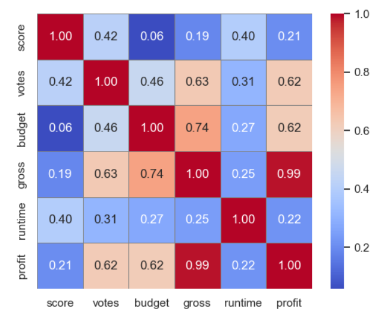

# Movie-Dataset-Analysis
This project uses a movie dataset with many nulls and inconsistencies. The data is first cleaned and transformed, then loaded into a SQL database for Future uses. Exploratory Data Analysis (EDA) is performed to uncover trends, followed by a summary of key insights

# Movie Dataset Analysis Project

In this project, we will work with a movie dataset to derive valuable insights. The steps involved in the analysis are:

1. **Data Cleaning**: Handle missing values, duplicates, and ensure consistency.
2. **Loading Dataset in SQL**: Load the cleaned dataset for further use.
3. **Descriptive Analysis**: Summarize key stats like mean, median, std dev for rating, score, budget, and gross.
4. **Exploratory Data Analysis (EDA)**: Use visualizations (histograms, scatter plots, correlation) to explore patterns.
5. **Insights**: Extract key insights like rating trends, budget vs gross, and genre popularity.

This project aims to uncover meaningful patterns and provide actionable insights based on the movie data.

### Dataset Links

-  [Original Dataset (Before Cleaning)](./Movie_Dataset.csv)  
-  [Cleaned Dataset (After Cleaning)](./movie_dataset_cleaned.csv)

### Data Description

- **name**: The title of the movie.
- **rating**: Age-based classification (e.g., PG, R, NC-17).
- **genre**: Genre(s) like Drama, Comedy, Action, etc.
- **year**: Year of release.
- **released**: Release date and country.
- **score**: Numerical rating or score of the movie.
- **votes**: Number of individual ratings/votes.
- **director**: The movie's creative lead.
- **writer**: The screenplay/script writer(s).
- **star**: Lead actor(s)/actress(es).
- **country**: Country of production.
- **budget**: Total production budget.
- **gross**: Box office revenue.
- **company**: Production/distribution company.
- **runtime**: Duration of the movie in minutes.

### Jupyter Notebook

-  [Movie Dataset Analysis Notebook](./Movie_dataset_analysis_jupyter.ipynb)

### Movie Dataset Insights Summary

---

#### 1. Action (PG-13) & Animation (PG) Are the Most Profitable Genres
- Action (PG-13) films earned approx **$178B**.
- Animation (PG-rated) movies showed consistent growth.
- Ideal genre-category pairs for maximizing profits.

---

#### 2. Unrated and NC-17 Categories Are Financially Risky
- Unrated: **-$573M** loss  
- NC-17: **-$104M** loss  

---

#### 3. U.S. Shows Consistent Growth, But China’s 2019 Surge is Remarkable
- U.S.: Steady growth from 2015–2018.
- China: Massive profit jump in 2019, especially in **Animation**, **Action**, and mature categories like **Not Rated** and **TV-MA**.
- This sudden spike may be due to increased production in these genres/categories.
- China data is missing for 2017–2018, so the growth may have started earlier but went untracked.

  
  

---

#### 4. Strongest Correlation: Votes ↔ Score — But Budget Doesn’t Guarantee Profit
- Highest correlation: **Votes and Score** → Movies with more ratings often have better scores, likely due to higher reach or quality.
- **Budget and Gross** show weak correlation → High spending doesn’t guarantee high returns.
- Low correlation between **Runtime** and **Profit** shows longer movies don’t always mean bigger success.
- Suggests: Success depends more on genre, marketing, and audience appeal than raw budget or length.

---

#### 5. Adventure & Biography Genres Are Declining
- Consistent financial losses.
- Audience interest shifting toward Action & Animation.

---

#### Additional Highlights
- **Highest profit**: Avatar (~$2.6B)
- **Highest budget**: Avengers: Endgame ($356M), Infinity War ($321M)
- R-rated category has 1,000+ nulls → data quality issue
- Overall profits trending **upward year-by-year**
